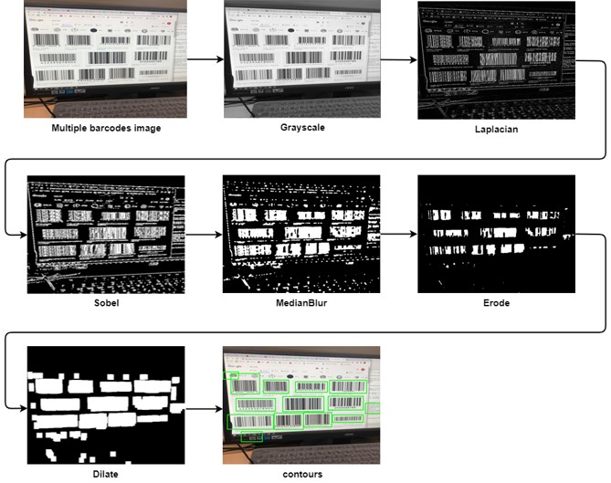

# Multi_Barcode_Detection
성능이 제한된 플랫폼에서도 사용할 수 있는 C++ 알고리즘 구현, 안드로이드에 사용하기 위해 NDK의 JNI 사용

## Demo
Ubuntu 환경에서 알고리즘 구현 테스트 데모

  

## Detection Algorithm
이미지 처리 과정

  

## Development Environment
* OpenCV 4.4.0
* Zbar 0.2.3
* Ubuntu 16.04
